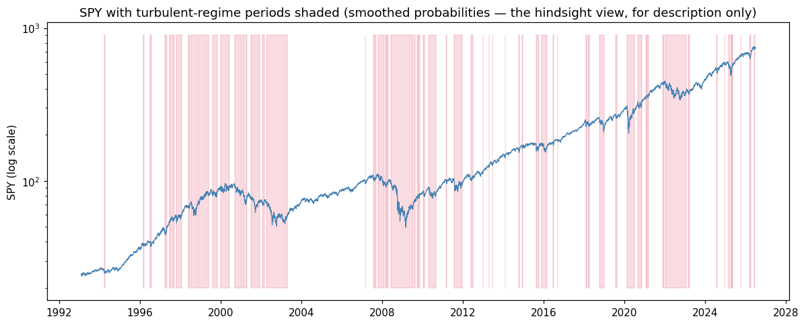
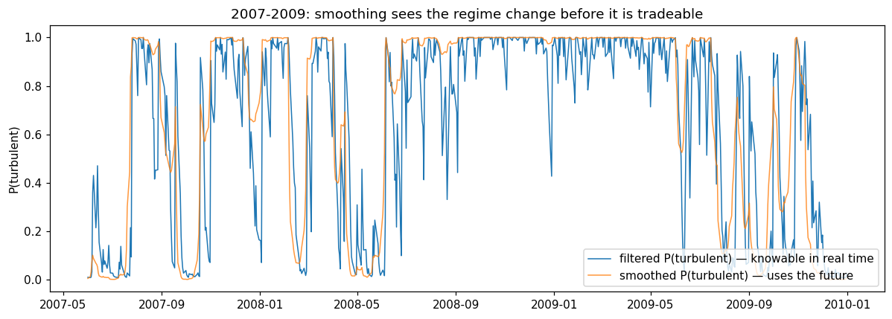
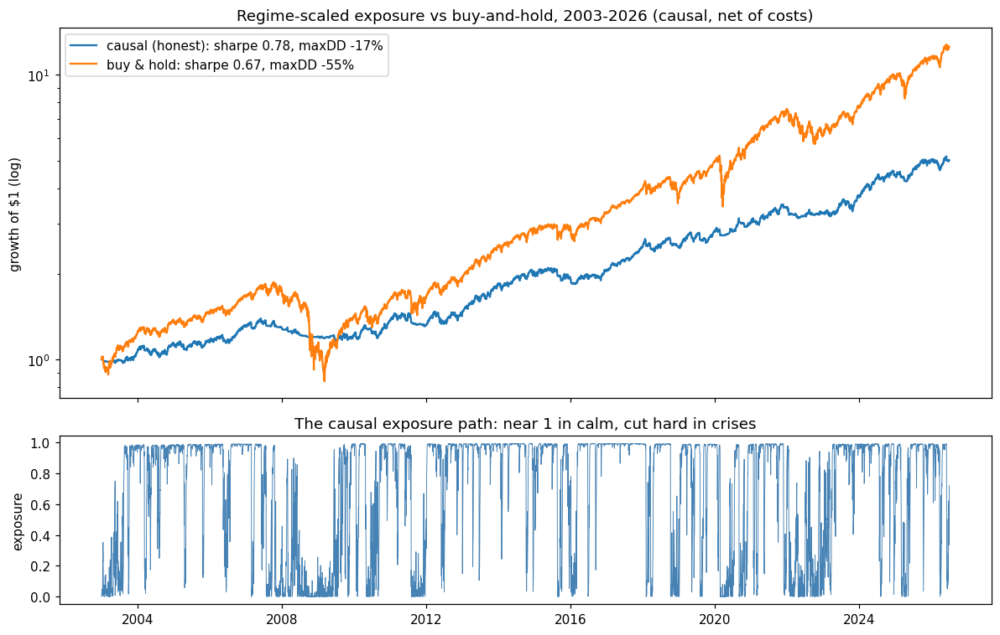
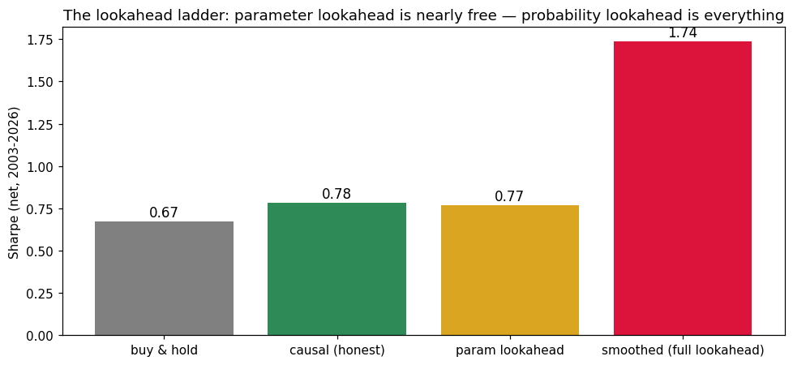

# regime-detection

[](https://github.com/dmitridefreitas-dev/regime-detection/actions/workflows/ci.yml)

📄 **[Report (PDF)](notebooks/regime-detection-report.pdf)** · 📓 [interactive notebook](notebooks/study.ipynb)

**Implemented a 2-state Gaussian hidden Markov model from scratch — Baum-Welch EM
with scaled forward-backward recursions, filtered and smoothed inference, Viterbi
decoding, ~200 lines, validated by recovering known parameters from simulated chains —
fit it to 33 years of SPY returns, and used it to localise exactly where lookahead
bias hides in regime-based strategies.** The headline exhibit is the *lookahead
ladder*: the same allocation rule scores Sharpe 0.78 evaluated honestly and 1.74
evaluated with smoothed probabilities — and, the nuance worth remembering, parameter
lookahead turns out to be nearly free while probability lookahead is everything.

## The model and what it finds

Daily index returns switch between two Gaussian states with Markov persistence. Fit to
SPY 1993–2026, the model recovers the canonical structure:

| regime | ann. drift | ann. vol | stay-prob | expected duration | share of days |
|---|---|---|---|---|---|
| calm | +24% | 10.8% | 0.986 | ~73 days | ~69% |
| turbulent | −15% | 29.2% | 0.970 | ~33 days | ~31% |



## Filtered vs smoothed — the distinction that decides honesty

- **Filtered** P(state | data up to today): causal, tradeable. Enforced by a
  *prefix-property test* — appending future data must never change past values.
- **Smoothed** P(state | all data): uses the future. Correct for historical
  description; lookahead if traded. A test proves it is not causal.



## The honest allocation and the lookahead ladder

Rule: exposure = filtered P(calm), refit each January on data through the prior
year-end only, positions lagged one bar, 2 bps on turnover (same execution contract
as [honest-backtester](https://github.com/dmitridefreitas-dev/honest-backtester)).
Evaluation 2003–2026:

| variant | Sharpe | ann. return | ann. vol | max drawdown |
|---|---|---|---|---|
| buy & hold | 0.67 | 11.4% | 18.6% | −55% |
| **causal (honest)** | **0.78** | **7.1%** | **9.3%** | **−17%** |
| parameter lookahead | 0.77 | 7.3% | 9.7% | −23% |
| smoothed (full lookahead) | 1.74 | 16.2% | 8.9% | −10% |





Two conclusions, both honest:

1. **Regime-scaling is a risk transformer, not a return machine.** It gives up ~4
   points of annual return for half the vol and a third of the drawdown. Attractive
   if you are leverage- or drawdown-constrained; not if you maximise return.
2. **The danger is in the probabilities, not the parameters.** Full-sample parameter
   fitting barely moves the result (0.77 vs 0.78) because regime parameters are
   stable; smoothed probabilities more than double the Sharpe because smoothing exits
   crashes it has already seen. Many published HMM backtests quote smoothed or
   Viterbi states — the crimson bar worn as the green one.

## What's implemented and how it's tested

| Piece | Tested by |
|---|---|
| Baum-Welch EM (scaled, no underflow over 8k+ obs) | Recovers generating parameters from a simulated chain (vols to 10%, transition diagonals to 0.02–0.03); log-likelihood monotone across iterations |
| Filtered inference | Prefix property: causal by construction, verified at multiple cutoffs |
| Smoothed inference | Provably *not* causal (the contrast test); classifies simulated states ≥ filtered accuracy |
| Viterbi decoding | Recovers planted calm/turbulent block structure |
| Allocation evaluation | Same-bar execution refused; cost accounting vs hand-computed example |
| Determinism | Median-split initialisation, no RNG: identical fits every run |

## Usage

```python
from regimes import GaussianHMM
from regimes.data import load_prices

returns = load_prices("SPY").pct_change().dropna()
model = GaussianHMM.fit(returns.to_numpy())

model.stds * 252**0.5                       # per-regime annualised vol
model.filtered_probabilities(returns.to_numpy())   # tradeable
model.smoothed_probabilities(returns.to_numpy())   # description only — never trade
```

```bash
pip install -e ".[dev]"
pytest                                  # 15 tests
jupyter notebook notebooks/study.ipynb  # re-runs the study (downloads SPY once)
```

## Limitations / what I'd do next

- **Two states is a choice.** A third state typically splits turbulence into
  correction vs crisis; model selection (BIC across state counts) is the next step.
- **Gaussian emissions understate within-regime tails**; Student-t emissions are the
  standard fix and a small change to the M-step.
- **The fair benchmark is volatility targeting**, which captures much of the same
  effect with no latent-state machinery — running that comparison is the most
  important missing experiment.
- 2 bps and annual refits are realistic for an ETF, but ~15x annual turnover has tax
  consequences the study ignores; and 23 years contains only a handful of regime
  cycles — the sample of *regimes*, not days, is what limits confidence.
